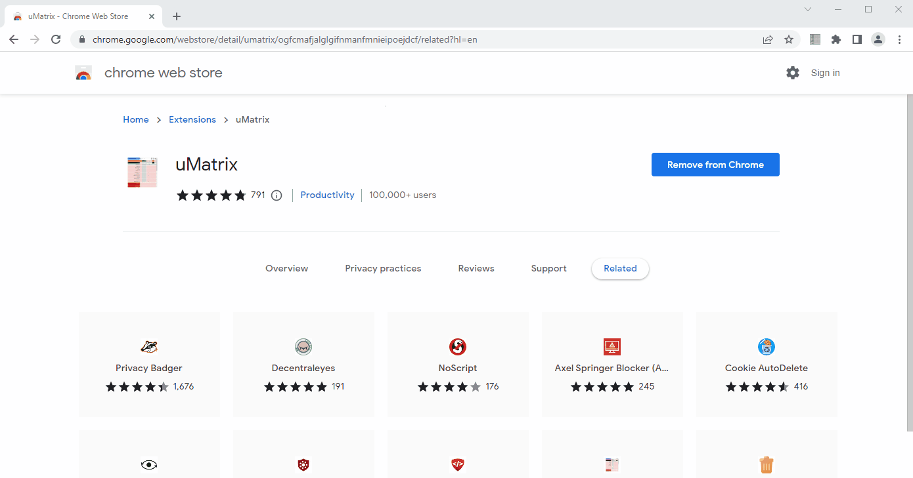

# How I try to use Internet without Ads and Trackers.

We all agree that today's internet is bloated with ads. But what most people don't know is that we're always being tracked and profiled to extract more information about us. Eg. On the CNN.com landing page, there are over 30 unwanted trackers that are not at all related to the content on the page. Companies use this information to either grow their own profits or sell them to other companies for a profit.

There are easy fixes to reduce this to a greater extent. It will

1. Make using the internet private and secure.
2. Make browsing significantly faster and snappier
3. Save your computer's resources (CPU and RAM) - "Figure 1" below shows that by removing the ads and trackers you can save 80% of computer memory (RAM). (Details of the tests are at the end of the article). (note: uBlock is an ad/tracker block extension which I will explain later in the article)

Figure1: Memory usage to load the CNN.COM website in different browsers. (lower is better)

In this article, I am explaining how I minimize ads and tracking when I use the internet in Web Browser, Mobile Phones (Android and IOS), and Android TV.

# 1. Web Browser

## 1.1 Block Website Ads and Trackers - uBlock Origin

I use the uBlock origin addon in the browser. It's available for all the popular browsers Google Chrome, Microsoft Edge, Firefox, Brave, etc. and it's an open-source project. ( if you don't know how to install a chrome add-on visit here). This will remove all intrusive ads and trackers from your browsing experience including YouTube ads. . In addition to that, this will also save ~60%-80% of your computer resources usage.
When you download the extension ensure that it's the correct extension because there are many malicious extensions on the extension store, pretending to be adblockers.

I generally block 3rd party scripts too. However, this may break certain sites. If you're interested to know the advanced functionalities of uBlock Origin, watch this video.
With Brave and Microsoft-Edge, there are ways to achieve a similar result by hardening the browser (Adjusting the settings). I use both ie. using uBlock origin within a hardened browser.

## 1.2 Skip YouTube Ads in the browser - SponsorBlock for YouTube

uBlock origin will take care of the general YouTube ads. However, this tool will automatically skip the inline ads/sponsorships that are embedded in the video itself.

The extension uses crowdsourcing (Information submitted by millions of its users) to identify the Ad durations in the video and automatically skips them.
This wouldn't give you any privacy/security or performance benefits, yet time-saving and a better experience. However, if you want to support the content creator, you can disable this.

## 1.3 Select the right browser

Ditch Google Chrome. Chrome will only be second to a browser from Facebook if they had one. In addition to user tracking chrome is renowned to be a resource hog.
I use Brave (with deactivated crypto) on my personal computer and Microsoft-Edge in the office. I harden all my browsers with settings and extensions for better privacy/security and improved resource usage. Both Brave and Edge give a similar or better user experience than Chrome. So if you're currently using Google Chrome switching will be easy.

# 2. Android

Note: For some of the below steps, you will need to know how to sideload apps to your phone. If you want to learn how. Caution: Only sideload apps from trusted sources.

## 2.1 Reduce App-based ads and tracking

I use [NetGuard](https://play.google.com/store/apps/details?id=eu.faircode.netguard&hl=en_AU&gl=US) with adblocking. For this, you have to download/install the latest NetGuard version [from GitHub](https://github.com/M66B/NetGuard/releases) (ad blocking is not possible with the Play store version because Google does not allow ad-blocking apps in the Play store). Then you activate the Pro version (either paying or using the free method). Then in settings, you can import the URL block list. You can follow the instructions mentioned [here](https://github.com/M66B/NetGuard/blob/master/ADBLOCKING.md).

If you're not sure about sideloading, use the play store version and block internet access to all apps that shouldn't use the internet. Eg. Calculator, SMS App, certain games, etc. This will block tracking to a certain extent.

I have come across another App called [Blokada](https://github.com/blokadaorg/blokada). It's an open-source adblocking app for android and iOS. Using this app is much easier, as you don't have to manually download the blocked URL list. _(Note: Though Blokada Slim is available in the app store its functionality is limited because blocking trackers is against google play policy. To get the full benefits you have to sideload the app either from the F-droid store or_ [_Blokada site_](https://blokada.org/#download=)_.)_

## 2.2 Block browser ads and tracking

I use the [Brave browser](https://play.google.com/store/apps/details?id=com.brave.browser) with its inbuilt adblocking feature. Another option is to use [Firefox](https://play.google.com/store/search?q=firefox&c=apps) mobile browser with the uBlock origin extension. I disable chrome on my phone.

I use the [Brave browser](https://play.google.com/store/apps/details?id=com.brave.browser) with its inbuilt adblocking feature. Another option is to use [Firefox](https://play.google.com/store/search?q=firefox&c=apps) mobile browser with the uBlock origin extension. I disable chrome on my phone.

## 2.3 Watch YouTube on mobile without ads

I use the NewPipe app. This removes the YouTube ads (not the ads/sponsorships recorded in the video) and google's tracking. I disable the standard YouTube app from my phone.

# 3. iOS

I use the [Lockdown Privacy](https://apps.apple.com/au/app/lockdown-privacy/id1469783711) app from the app store. I only use the free tier functionality, which is sufficient. On a normal day, me being a very light phone user, the app blocks over 200 tracking attempts from my phone.

# 4. Android TV

## 4.1 Watch YouTube without ads and tracking

I use [SmartTubeNext (smartyoutubetv.github.io)](https://smartyoutubetv.github.io/) on my Andriod TV. For this, you have to sideload the app into your TV. This app is integrated with the SponsorBlock app, so it will remove both native YouTube ads as well as inline sponsor ads.

# I am not against advertising

Don't get me wrong. I am PRO online advertising. The online advertising business model made most of the free services that we use online, such as Gmail, Google Maps, and LinkedIn (NOT Facebook. Facebook is evil) possible. It created a new industry that many people are making a living out of. If not for the online advertising model, the internet wouldn't have grown this fast.

However, I am against obtrusively tracking every single move of ours, hiding behind the hideous "terms and conditions". I am against the unnecessary use of my computer resources without adding any functional or experiential value. This is not only me. There is a larger movement against it and some governments have started interfering. I believe it's time for most of these big techs to find a better business model than intrusively extracting user data.

I would be interested to know if you have other tips or tricks that you're using that make browsing safer and better.

## Annex: Resource implications of web browsing without any ad+tracking protection

I monitored the resource usage of the CNN.com website in different scenarios to see the implications of advertisements on resource usage and hence the browsing experience. I used the browser task manager to monitor the resource usage (This helps us to understand the components and their memory and CPU usage).

In Test 1 - Standard Google Chrome uses 161MB to load the CNN website. In addition to that, there are different subframes (with the prefix "subframe") that are either tracking me, serving me ads, or both built into this webpage, using additional resources. The total memory footprint is 373MB. In Test 4 with uBlock origin basic, the total usage is 62MB, which is an 83% reduction in Memory Usage. Better yet it blocks all the trackers embedded in subframes.

Test 1: Using standard Google-Chrome - Ram Usage: 373MB

 
Test 2: Using Microsoft-Edge - Ram Usage: 352 MB (6% lower than chrome)

 

Test 3: Microsoft edge with Strict Tracking Prevention setting - Ram Usage: 145 MB (60% lower than Google Chrome)

 

Test 4: Using the Brave Browser with standard settings - Ram Usage: 64MB (83% lower than chrome)

 

Test 5: Using Microsoft-Edge with uBlock - RAM Usage: 62MB ( 83% lower than chrome)
