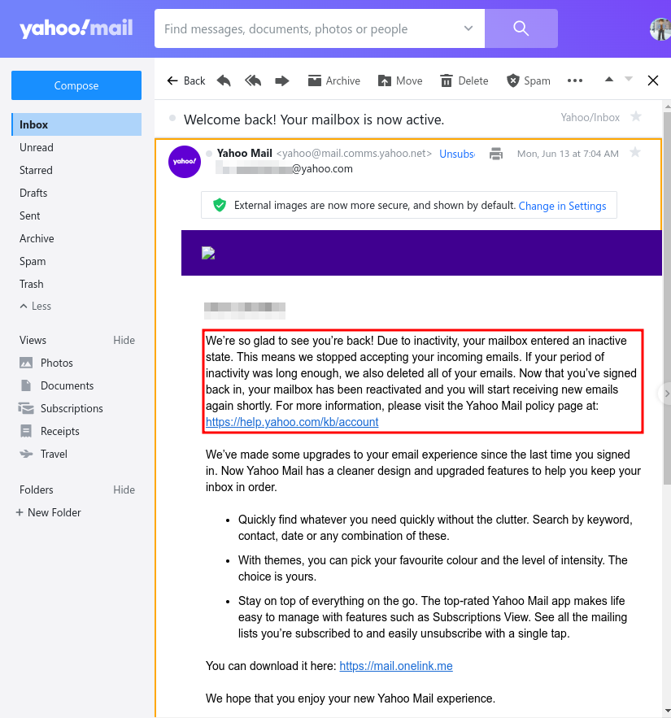
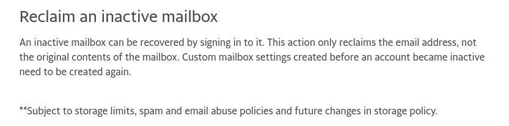
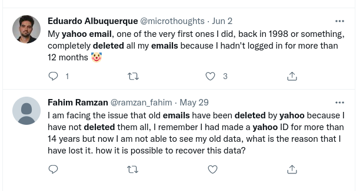
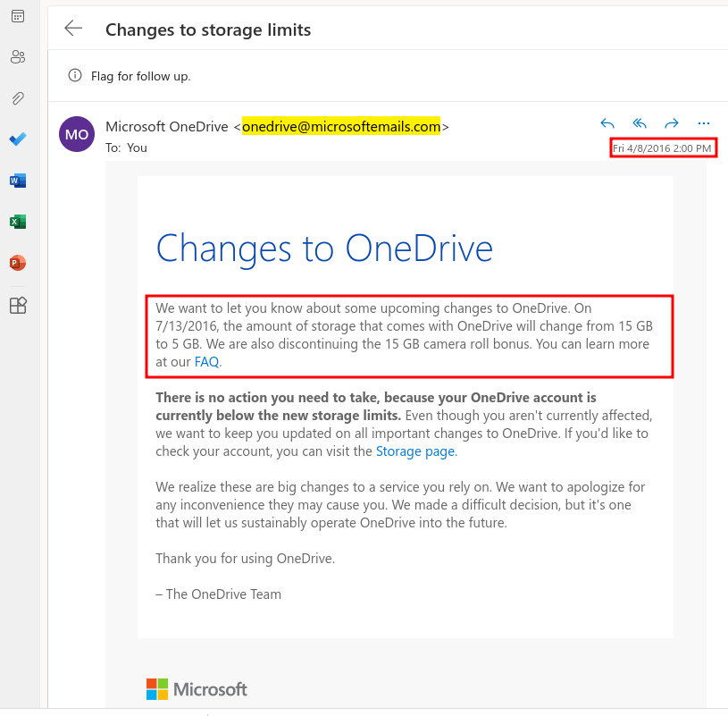
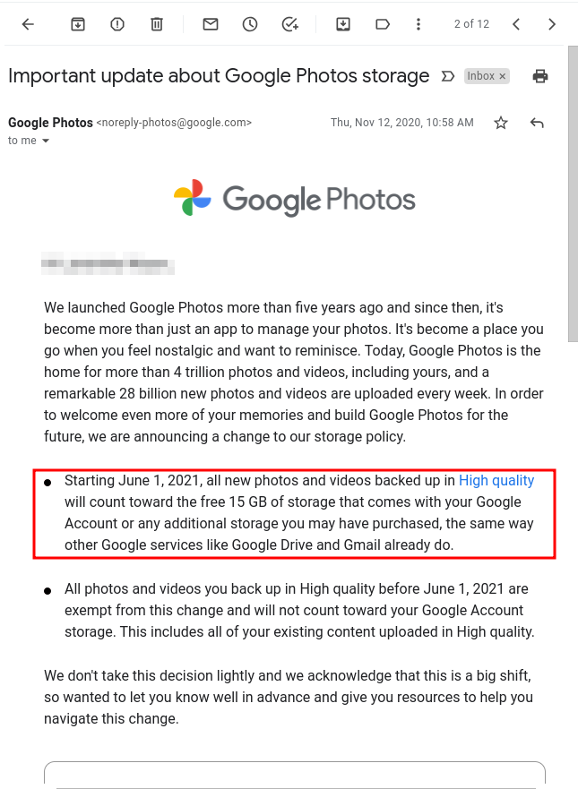
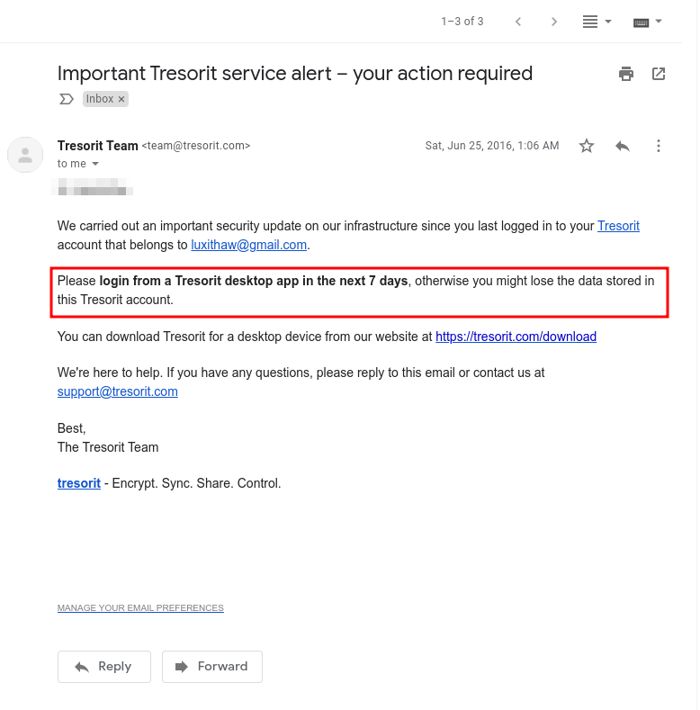
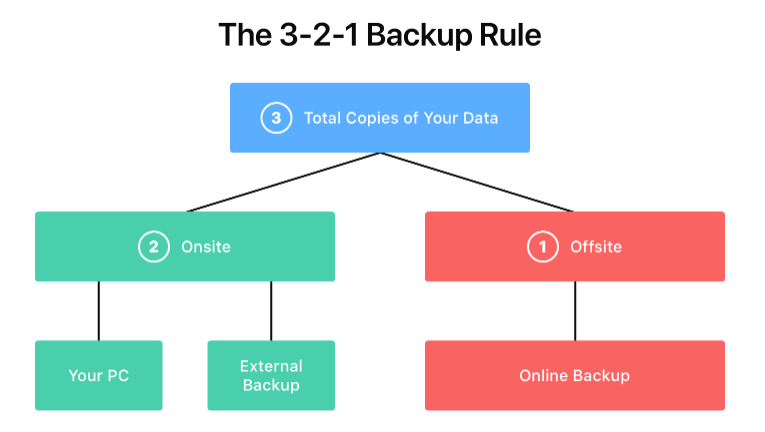

## I lost all my yahoo emails overnight

My first email address was a yahoo email. It was the time that yahoo was now Google. [altavista](https://en.wikipedia.org/wiki/AltaVista) days. It was the time that you had a crazy email username that you couldn't use in your resume, yet amongst your friends, you looked "cool" to have an email address like that. I stopped using this email when I realized that it doesn't look "cool" to use it anymore. However, because of my nostalgia, I kept it active. Time-to-time I accessed this mail account to re-read some of my old emails. This account grew up with me and contained some emails about a few milestones in my life. All this came to an end when I accessed this account last week, to see that all my emails have vanished. And I was greeted with the below message.

And to make it worse, Yahoo doesn't offer a way to recover the deleted messages. So all my emails are gone forever.

I was not alone. With a quick Twitter search, I could find that many others are also facing the same issue.

I was furious. How could they do it? Those were "my" emails. And I waited a week to write this article until I realized the fault is all mine. Until I realized that even though I call them "my" emails, they were never mine. They would have been mine if I kept a local backup. Else, I wouldn't have written this article objectively with a balanced mind.

In yahoo's defence, they had sent me an email a month before deleting my emails, warning me about it. However, the recovery email address that I had set up for this account was another inactive mailbox that I don't check very often. So I was too late.

## We depend too much on the big-tech and the cloud

Despite the legality of this incident, this raises a question as to who owns our data. We have this notion that it's our emails and our data. However, the bitter truth is we don't have any control over this data unless we store them locally on a hard drive. The digital economy has fundamentally changed the concept of ownership.

The tried and tested business model is,

1. Offer the free/freemium service initially and get the critical mass in. At this point, the free service offering is attractive to onboard as many customers as possible, as fast as possible. It is part of their growth hacking.
2. Over time, reduce the benefits for the free tier to convert free users to paid customers. If the service has a higher switching cost, many customers will switch to the paid version.
3. If the business model is not viable and the company doesn't reach its financial goals, discontinue the service or focus only on the profitable customer segments.

## This was not the first time

This was not the first time that I went through this experience.

1. In 2016, Microsoft reduced their free quota of Onedrive. It meant that if a person was already above that limit, he/she couldn't have any more data on Onedrive, without paying.

2. In 2020, Google stopped its free Google Photos service and started charging.
. I wrote a previous article about this.

3. In 2016, I lost some data that I stored with the cloud service provider due to not being active on the account. [tresorit](https://tresorit.com/)

4. In 2012, google cancelled the "[Google Notebook](https://www.google.com/googlenotebook/faq.html)" service that I used to depend heavily on. Then I moved to Evernote for a short time and then to Microsoft OneNote. Recently, I started using Obsidian which is a 100% locally managed text notes database.

5. In 2014, google killed "[Google Reader](https://en.wikipedia.org/wiki/Google_Reader)" which I used to use extensively to read my RSS feeds. Now I use [Feedly](https://feedly.com/).

6. in 2019, [dropbox added a three-device limit for free users](https://www.theverge.com/2019/3/14/18265574/dropbox-3-device-limit-free-accounts-plus-professional). I used Dropbox as my primary cloud backup at this point. Then I moved to [Mega](https://mega.io/).

7. In 2021, [LastPass added a device type limit to their free users](https://blog.lastpass.com/2021/02/changes-to-lastpass-free/). At this point, all my passwords were with Lastpass. Then I moved to [bitwarden](https://bitwarden.com/), a much better free and open-source service, that I am using today. I also use [keepassxc](https://keepassxc.org/) locally, as a backup.

8. In 2016, [Evernote introduced a device limit of 2, for their free customers.](https://www.theverge.com/2016/6/28/12052056/evernote-price-changes-basic-plus-premium). Later in 2019, they started counting the web as another device. However, by this time, I had already moved to OneNote.

These are only my personal experiences. And also there have been many services other than the mentioned above, that had done the same thing. In certain cases, even after paying for the services, the customer had lost access to the services/products.

- Closure of the Microsoft ebook store has resulted in users losing access to the ebooks they purchased by paying money. Read the [BBC article](https://www.bbc.com/news/technology-47810367).
- Some hardware manufacturers had backtracked on their promises of providing security upgrades.

## Important question is... What did I learn from this?

It's not practical to stop using these services in today's world and I am not advocating for it. But at the same time, we should be aware that we are not in control of the platforms that we are using. Even in the cases where a platform is keeping our data, still, they are in control.

1. Plan for the worst-case scenario
This is the most crucial first step. Expect the primary services that you use today, will not be there tomorrow. If that happens, what will you lose? This is not being all negative about technology, yet having a backup plan in case the worst happens. Especially in regards to online/cloud/tech services. To a certain extent, I was practicing this, yet certainly I had not done enough.

- I reset my phone time-to-time and then restore it to its working state. This not only simulates the successful restoration of my backup but also improves the security. Because over time, I keep gathering many unwanted apps.
- I wipe my personal computer time-to-time and rebuild it from scratch. Since I've done this many times, I have automated most of it.
- for most of the tech services I use, I keep a backup service active and up-to-date.

I may sound paranoid, but I enjoy it. I believe, anyone should at least reset their phone once a year.

1. Backup, Backup, Backup
Follow the 3,2,1 rule of backup.
Backups in 3 places, 2 different mediums and one offsite (eg. cloud)

In the case of the yahoo incident highlighted, I failed to maintain backups and hence I lost all my data. Luckily it was some old emails that didn't contain anything important (yet some memories :( ). I had already done this for the rest of my data except emails.

- (2 mediums locally) I maintain local backups on hard drives. And you should keep more than one. Because hard drives can fail and they will at the most critical moment.
- (1 offsite) I use almost all mainstream cloud storage service providers (dropbox, box.com, google drive, mega) and backup important data across multiple services. Since I started using these services at a much earlier stage, I have a decent quota.

- After the yahoo incident, I am downloading a local copy of my main email box. I plan to use my primary email synced locally with Thunderbird. Then even if the service goes offline overnight, I will have my emails.
- In the long run, I will most likely go for a local NAS, like Synology.

1. Have substitute services
Always have substitutes for the tech services you use, and actively keep using the substitute service. The switching cost of these services tends to be very high, which is how they are designed to be. A good example is notetaking services such as Evernote, OneNote etc. Once your workflow is optimized to a particular service and once you've built up your notes repository in a particular app/service, it's very difficult to migrate to another service.

In the future, I will write another article about how I keep my data backed up locally and in the cloud.
