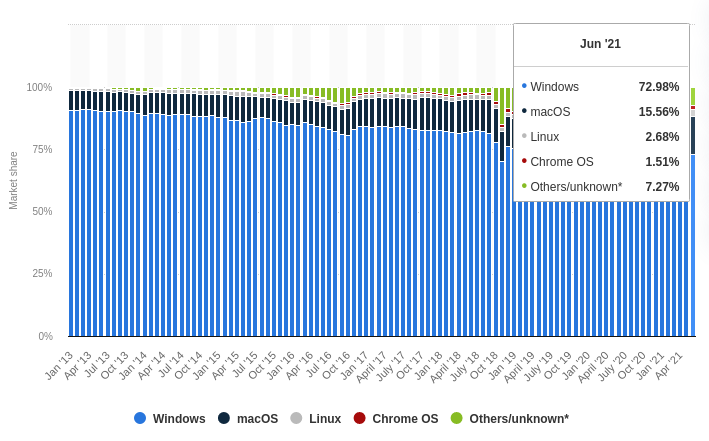
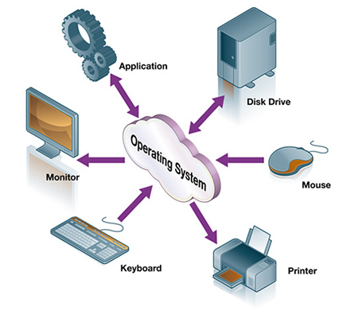

# Why I love Linux and why you should too

## What is Linux?
Linux is an Operating System, like Windows and MacOs. Linux holds a share of 2.7% of all the operating systems.

And for those who are interested, an operating system is the element in our computers that is responsible for coordinating tasks between
- system hardware (CPU, RAM etc)
- Input/Output devices (Keyboard, mouse, monitor, speakers)
- Applications (MS Office, Photoshop, Web-browser)

## Why I love Linux
1. The Philosophy
Free: Linux is Free. Windows and MacOS aren't. When you buy a computer with Windows/MacOS you're not only paying for the hardware, but for the OS. While the two dominant operating systems (windows - starting USD 119 and MacOs price bundled in to hardware).

Not only the operating system. Almost all the programs in linux are free too. In the past 10 years, I've not come across a task that I couldn't do in Linux with a Free alternative. (Unless it's a very specialized commercial software)

Open Source: The source code of linux is Open. Meaning anyone can and see it in https://github.com/torvalds/linux.git. In Windows/MacOS even after paying for it, you dont know what happens in there.

2. Extremely Lightweight
Linux OS alone is very lightweight. It's the OS of choice for older hardware. While other OS's like Windows/MAC continuously increases the minimum hardware requirement for every new release, with Linux I am totally in control how light or heavy I want to make it be.

My current personal computer is a 2012 HP Probook 4440s with an HDD harddisk (which is almost about to die. HDD can be 5-10x slower than todays nvme hard drives), with a Gen2 intel CPU with 6 GB RAM. Yet I do video editing, photo editing, coding, virtualization in it without any issue. And when I use windows, I can hardly open multiple excel models at once.

I've made my system very lightweight. After a reboot, even with all my startup apps, my linux machine only uses 300-500MB of Memory. (I use window managers. With a normal Desktop environment like Windows/Mac you can manage with 700MB)

3. Privacy: Linux doesn't spy on me. In contrast, we hardly have any control over Windows/Mac OS. In the name of continuous improvement, giving the fancy name "telemetry", they are monitoring, recording and mining every move I make. Even after paying the full price, I cannot control it. I wouldn't even talk about Chrome OS and Android, because it will be a joke.

4. Less (No) Viruses
Linux has "less" or "no" viruses. It is due to three main reasons.
- Linux user share is 3%. A attacker would rather spend his time and effort to exploit and OS which has a much higher market share, to profit from it.
- Linux is open source. Since Linux is opensource, vulnerabilities get discovered and patched much faster.
- Linux is better designed. I am not an expert is this area. But this is one reason why Linux is used in majority of the webservers. And the way the files access control is designed makes it harder for an attacker to exploit.
- All linux software are installed from a centralized repository. You don't need to download from a shady website on the interenet. (Windows is going to copy this with the winget installer)

5. Customizeability
For me personally, this is the biggest differentiator after lightness. Be it your workflow, or how it looks... With Linux you can customize anything to your heart's content. And once you customize something, its easily reproduceable. Since everything is a file in linux, 	you just have to copy paste the files in to a single folder. (The folder structure in linux is the same. You just copy/link the files in to .config folder in your home directory)

Eg. I have synced all my configuration files in a Github Repo and made scripts to reinstall everything. So within a few seconds, I can recreate my exact environment. In fact, I generally reinstall my OS every few months, for the fun of it.

6. Control of my workflow

The first time I came across linux is in 2004, when I had to do the C programming language module in the university. I used Knopix live-cd without any understanding about what it is. Then I started using linux properly, in 2008, when I was a system administrator at a Telecom service provider. I got the opportunity to learn linux from some of the veterans in the fie.

##

